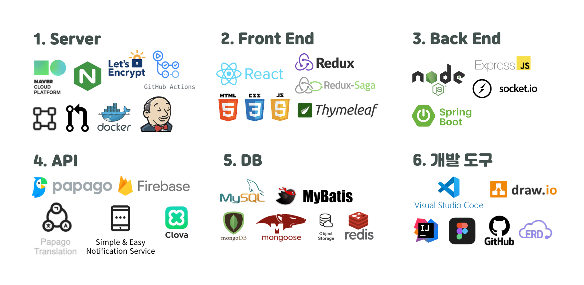
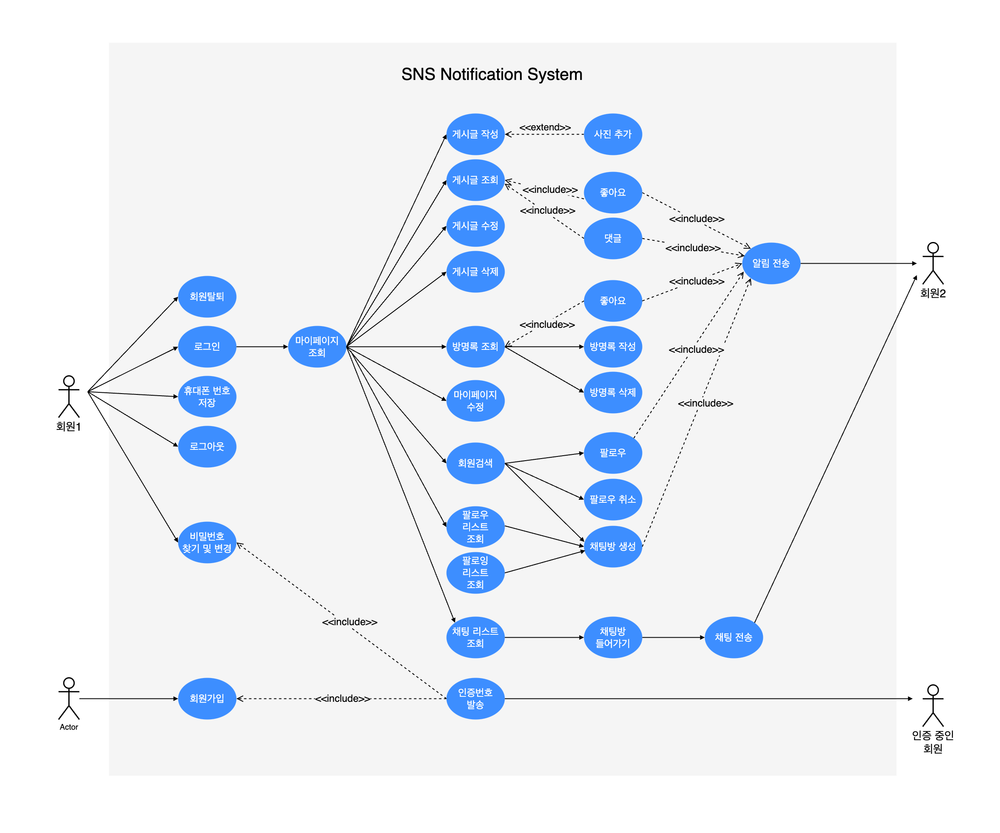
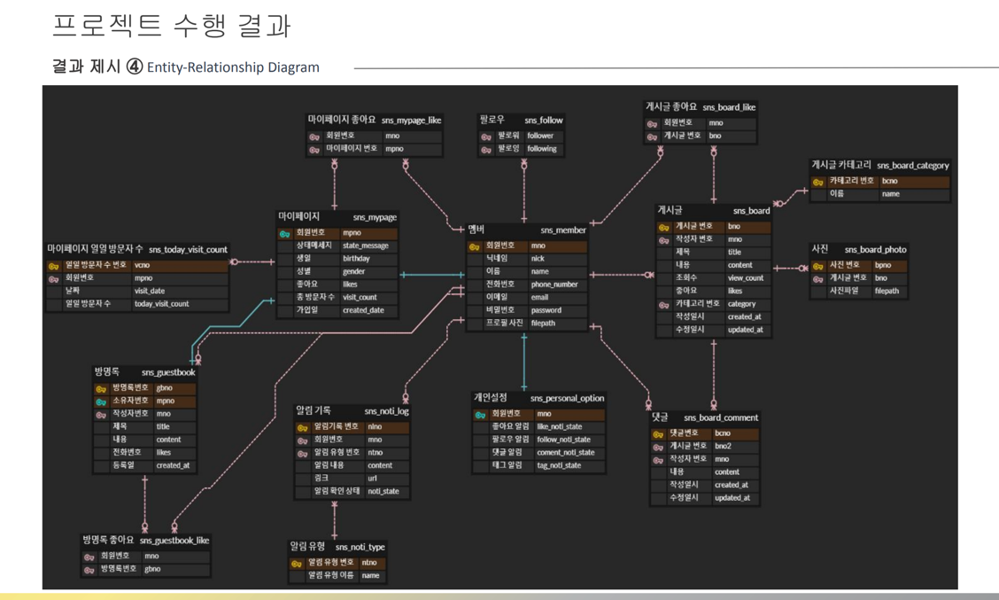
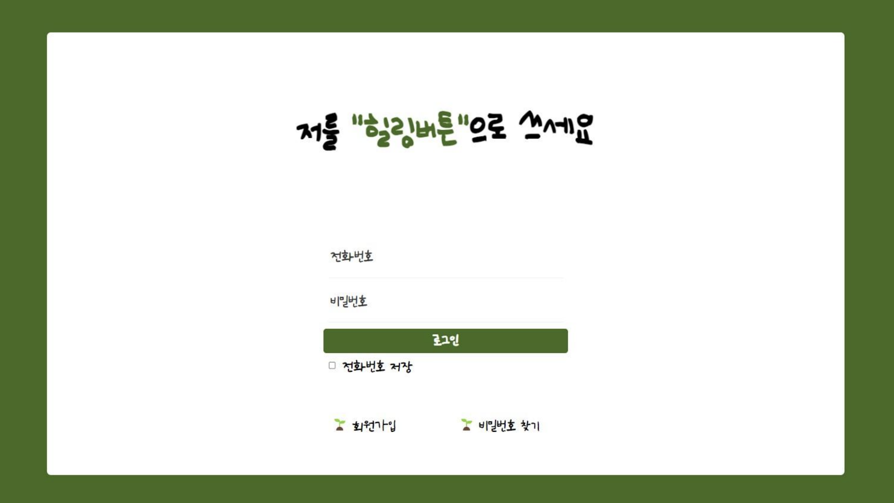
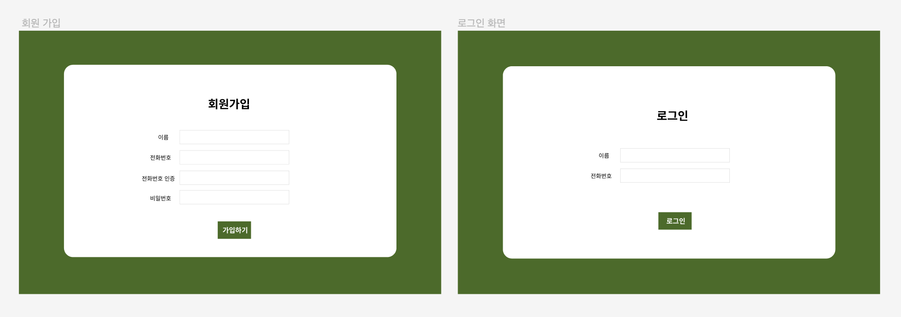
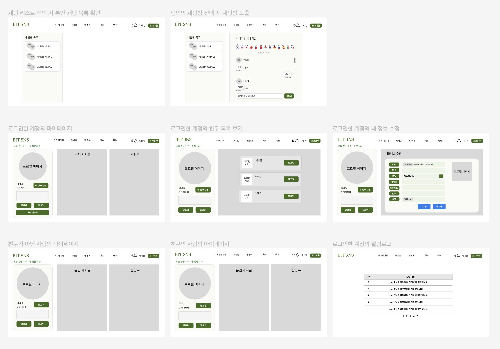
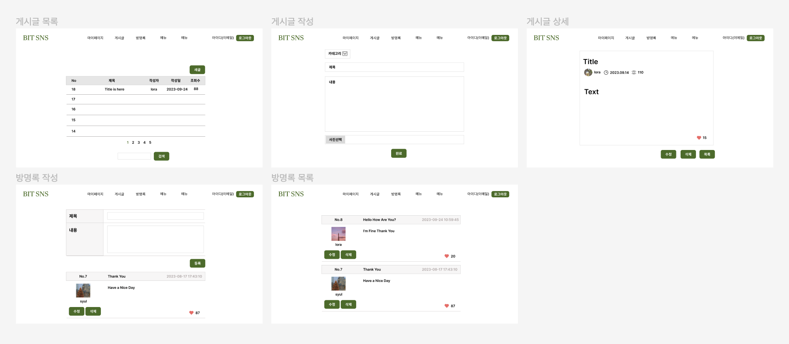
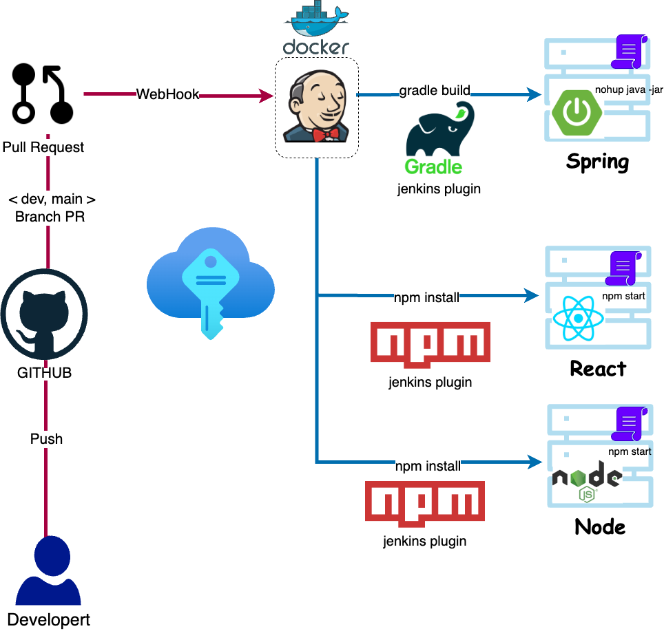

<!--  -->

# 1조 힐링캠프 ( snsapp )
[프로젝트 역할 분담 및 시연 영상](https://ncamp.magicecole.com/Home/Project/023ef993-a000-40b8-8cfa-0c1d9b19299c?page=1&groupId=0)

 

## 목차

### 1. 프로젝트 목적
   - 프로젝트 목표
   - 프로젝트 주제
   - 구현 목표
### 2. 프로젝트 정보
   - 사용기술
### 3. 비즈니스 상세 요구사항

### 4. 유스케이스 모델링

### 5. ERD

### 6. UI

### 7. 아키택처
   - API
   - Server (Cloud)
   - CI/CD
 

---
 

## 1. 프로젝트 목적
### 프로젝트 목표: 글로벌 사용자 대상 힐링 웹 서버
### 프로젝트 주제 : SNS 알림 및 채팅 시스템 구축 프로젝트
### 구현목표

|  대분류  |                         중분류                         |                                              소분류                                           |
|:-----:|---------------------------------------------------|------------------------------------------------------------------------------------------|
| 회원가입  |                    회원가입 로그인                     |  - 로컬 회원가입 (닉네임, 전화번호, 이메일, 비밀번호, 사진 순으로 ) - 로컬 로그인, 아이디 찾기 (번호 인증)  - 소셜 로그인 (with Naver) |
| 마이페이지 |                    내 정보 수정                      |       - 이메일 변경 - 닉네임 변경 - 비밀번호 변경 - 프로필 사진 변경  - 상태 메시지 변경 - 생년월일 추가 - 회원 탈퇴     |
| 마이페이지  |                   친구검색 팔로우 조회                   |                               - 회원 검색  - 팔로워/팔로잉 목록 조회 및 팔로우 기능                            |
|  게시판  |                게시글 CRUD 댓글 CRUD                 |           - 게시글 작성, 조회, 수정, 삭제, 사진 파일 추가 / 삭제   - 댓글 작성, 조회, 수정, 삭제                                                                               |
|  방명록  |                      방명록 CRUD                       |                               - 방명록 작성, 조회, 수정, 삭제                                                             |
|  채팅   |                       텍스트 채팅                        |                            - 친구 목록 - 1:1 채팅 - 언어 감지 및 실시간 번역 - 텍스트 전송                                                                |
|  알림   |  팔로우 알림 좋아요 알림 게시글 알림 댓글 알림 채팅 알림   |           - 알림 기록 조회, 알림 조회 여부 확인, web push                                                                                 |
|  팔로우  |             팔로우 팔로우 취소 팔로우 목록	              |                   - 팔로우 - 팔로우 취소 - 팔로우 목록 조회                                                                         |
| 메인화면  |                  헤더 푸터 본문	                  |                 - 채팅, 마이페이지, 게시판, 방명록, 로그아웃, 알림 - 전화번호, 사업자명 - 본 기능 화면|

 

## 2. 프로젝트 정보
### 사용 기술

| **분류** |             **기술**               |
|:------:|-------------------------------------|
| DB    | MongoDB, MySQL, Redis  |
| Language    | Java, JavaScript  |
| Framework    | React, Express.js, Spring Boot |
| Tool   | IntelliJ, VScode, Postman   |
| API   | Papago Translation Api, Papago Detect Api, Clova Voice, Firebase, Simple & Easy Notification Service   |
| ETC   | Naver Cloud Service(Object Storage, Image Optimizer, Cloud DB for MySQL, Global DNS, VPC, Server, Load Balancer)   |
| GIT   | https://github.com/NC7-1st-TeamProject-1st-Team   |

 

## 3. 비즈니스 상세 요구사항

[2차 팀 프로젝트 요구 명세서 - 이용자 기능 요구사항.pdf](2%EC%B0%A8%20%ED%8C%80%20%ED%94%84%EB%A1%9C%EC%A0%9D%ED%8A%B8%20%EC%9A%94%EA%B5%AC%20%EB%AA%85%EC%84%B8%EC%84%9C%20-%20%EC%9D%B4%EC%9A%A9%EC%9E%90%20%EA%B8%B0%EB%8A%A5%20%EC%9A%94%EA%B5%AC%EC%82%AC%ED%95%AD.pdf)

| **우선순위** |         **상세**                       |
|:------:|-------------------------------------|
| 상    | 꼭 필요한 기능                            |
| 중    | 있으면 좋은 부가적인 기능들                     |
| 하    | 필요한 기능 먼저 만들고 시간이 남아 있을때 작업하면 좋을 것들 |
| 보류   | 논의가 필요한 것들                          |

 

## 4.유스케이스 모델링

 

## 5. ERD

 

## 6. UI
### 메인 페이지

   

### 프로토타입
#### 로그인/회원가입

  

#### 마이페이지 + 채팅

  

#### 게시글

  

## 7. 아키택처
### - API_architecture
  
### - Cloud_architecture
  
  
### - CICD_architecture
  
